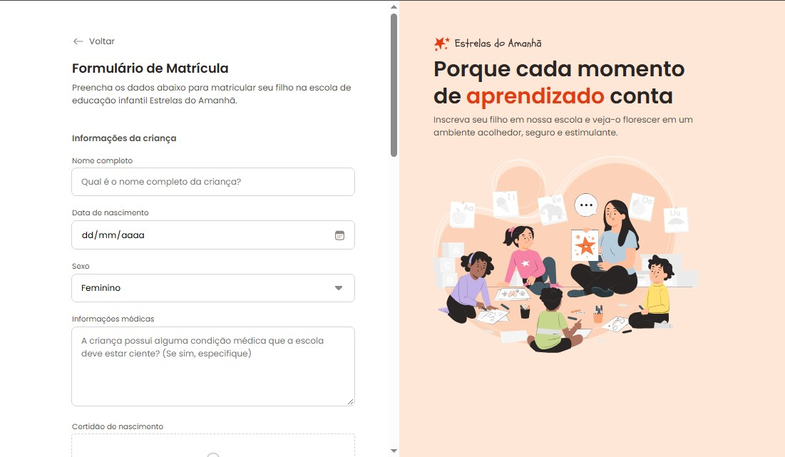

s

  

# 🍰 Formulário de Matrícula

> Projeto desenvolvido durante o curso **Full-Stack da Rocketseat**, com o objetivo de praticar o uso de **Formulários** e **CSS** na criação de uma página simples e bem estruturada.

A página apresenta uma página de **Matrícula**, com layout limpo e tipografia elegante.

---

## Estrutura do projeto
Principais arquivos e pastas:

- `index.html` - página principal do projeto
- `style.css` - estilos globais e layout da página
- `assets/` - pasta com imagens e recursos estáticos

---

## 🧠 Tecnologias utilizadas
- HTML5  
- CSS3  
